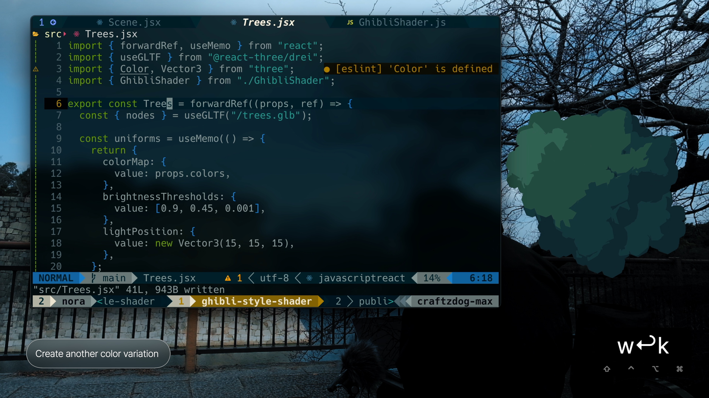
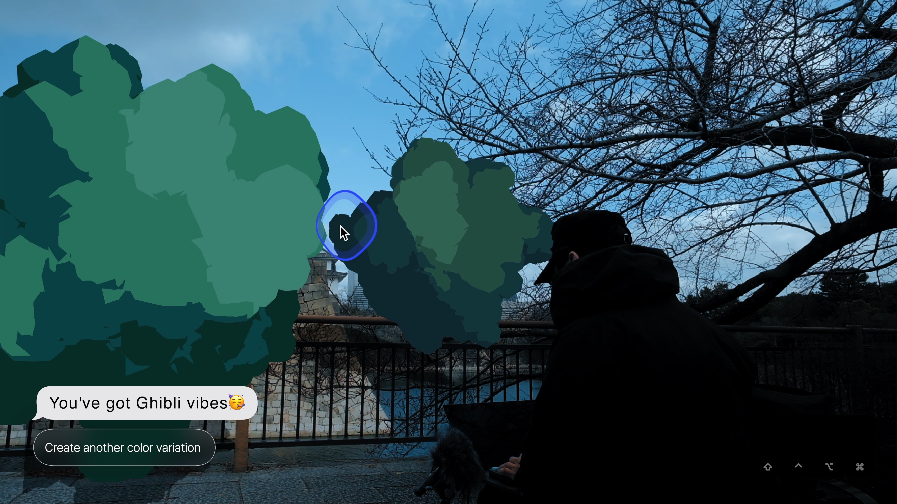
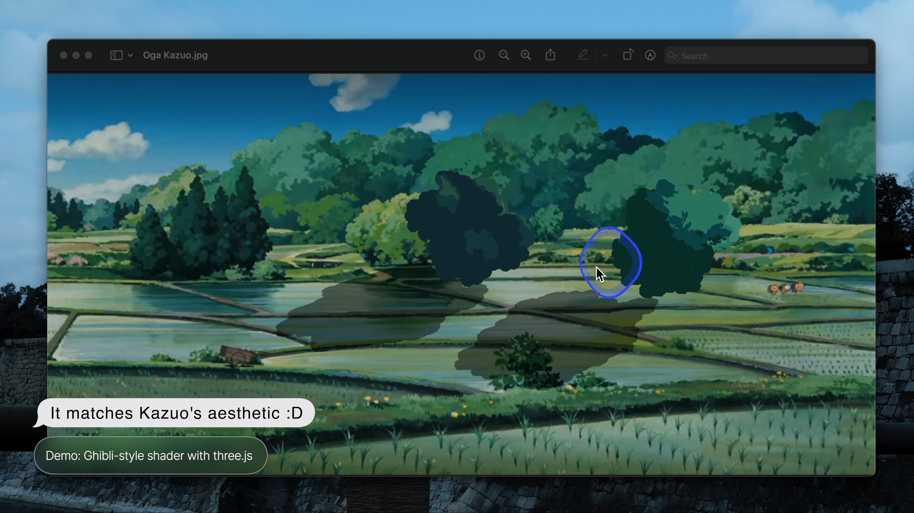

# Ghibli-style Trees Example

[Video tutorial](https://www.youtube.com/watch?v=IGK6eceWyU4)







## Ingredients

- React - A JavaScript library for building UIs
- [Three.js](https://threejs.org/) - JavaScript 3D library
- [React Three Fiber](https://github.com/pmndrs/react-three-fiber) - A React renderer for Three.js
- [@react-three/drei](https://github.com/pmndrs/drei) - Useful helpers for Fiber

## How to use

```sh
npm i
npm start
```

## References

- [How to Create Ghibli Trees in 3D - Blender Tutorial, by Lightning Boy Studio](https://www.youtube.com/watch?v=DEgzuMmJtu8&ab_channel=LightningBoyStudio)

---

Looking for a Markdown note-taking app? Check out my app called Inkdrop:

[](https://www.inkdrop.app/)

## License

MIT
